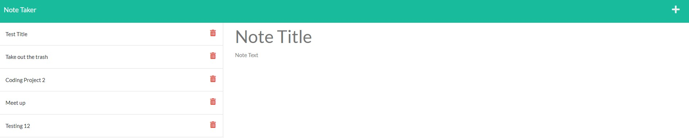

# Do Note Forget

## Table of Contents

- [Project Description](#Description)
- [Installation](#Installation)
- [Usage](#Usage)
- [Collaborators](#Collaborators)
- [GitHub](#GitHub)

## Description

### Motivation for creating this project

I built this Note Taker application to use Express.js for the first time. It was the perfect project to build a small backend server.

### What problem does this solve?

This application will help people with a busy schedule organize their to do list stay productive all day.

## Installation

In order to download my code you will have to clone my repo and install express.

## Usage

As we mature, we will gain more responsibility in our life whether that is in our work-life or personal life. Using this application will help stay origanized and maximize your day.

## Collaborators

I would like to give credit to Xander Rapstine (https://github.com/Xandromus) and John McCambridge (https://github.com/nol166) for being contributers on this project by providing the front-end code.

## Contact Me

See other projects I have created at https://github.com/DouglasRed

Contact me at douglasred63@yahoo.com for any questions you have about my project.

## View My Video

View my video of this project here! https://github.com/DouglasRed/do-note-forget/blob/main/Do%20Note%20Forget.mp4 (Please note: you may have to download this 5 minute video)
